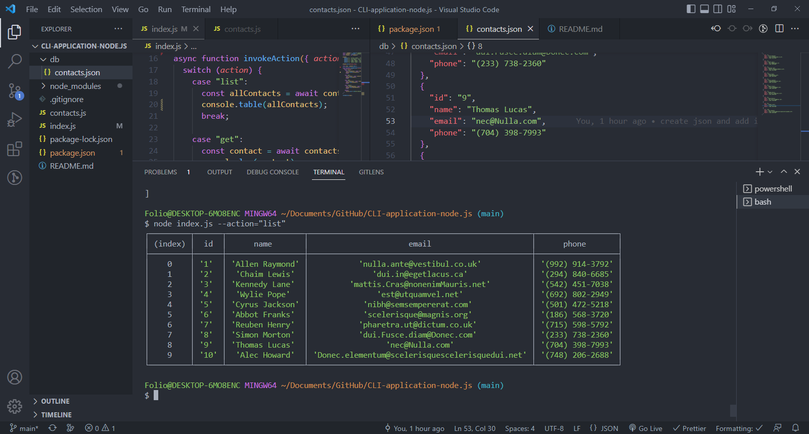
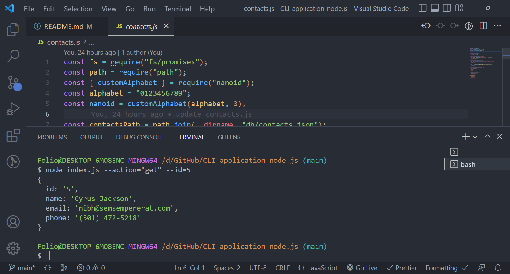
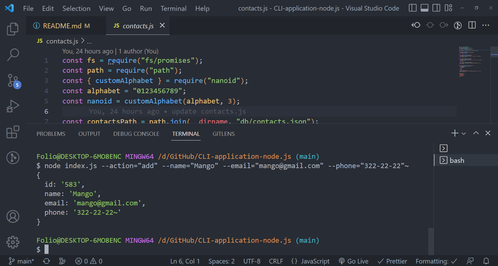

# CLI application &nbsp;&nbsp;

<h3>Functionality:</h3>
<ul>
<li>Allows to get all contacts from json file</li>
<li>Allows to get particular contact by ID</li>
<li>Allows to add new contact</li>
<li>Allows to remove any contact by ID</li>
</ul>

<h3>Usage:</h3>

There are 4 types of commands for actions listed above. You can find examples below, please run the commands in the terminal. 

<ol>
<li>node index.js --action="list" Receive and display the entire list of contacts. </li>
<li>node index.js --action="get" --id=5 Receive and display particular contact. </li>
<li>node index.js --action="add" --name="Mango" --email="mango@gmail.com" --phone="322-22-22" Add new contact to the list. </li>
<li>node index.js --action="remove" --id=1 Delete contact. </li>
</ol>

<h3>Screenshots of command execution:</h3>
<ol>
<li></li>
<li></li>
<li></li>
<li></li>
</ol>
<!--  -->
